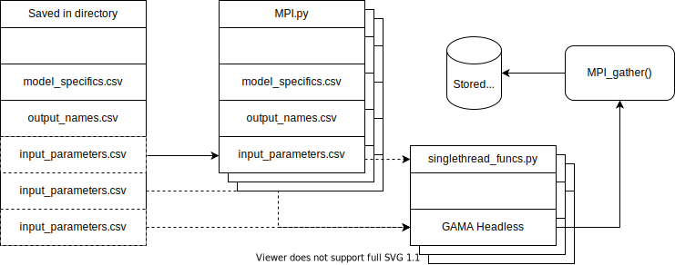

# GAMA_MPI4Py
This repository presents a method to efficiently save data from models written in [GAML](https://gama-platform.github.io/) and can be executed by [GAMA Headless mode](https://gama-platform.github.io/wiki/Headless). 

GAMA currently provides limited built-in tools for model analysis, therefore one might be willing ot reside to other tools. The scripts in save model results in the [Feather file system](https://arrow.apache.org/docs/python/feather.html), which can be used both in Python and R. 

Parallelisation of the scripts is achieved by using [MPI for Python](https://mpi4py.readthedocs.io/en/stable/). Currently, supporting software for this package is not available Windows and thus these scripts are only tested on an Ubuntu installation. 

## Necessary packages
The repository provides in an Anaconda environment save file (environment.yml). Importing this environment file will install the following packages: 

_To view the Toturial and Benchmark Notebooks_
1. [Jupyter lab](https://jupyterlab.readthedocs.io/en/latest/)

_For necessary functionality_ 
2. [Pandas](https://pandas.pydata.org/docs/) : Reading an writing Datafiles  
3. [Numpy](https://numpy.org/doc/stable/) : Manipulating data arrays 
4. [MPI for Python](https://mpi4py.readthedocs.io/en/stable/) : Parallelisation of tasks 
5. [PyArrow](https://arrow.apache.org/docs/python/) : Supporting software dealing with the Feather file system 
6. [tempfile](https://docs.python.org/3/library/tempfile.html) : Creating temporary file locations (built-in Python functionality)

_To view plots in the Toturial Notebook_ 
7. [MatPlotLib](https://matplotlib.org/stable/users/index.html)

## Functionality

The functionality can be roughly subdivided into three parts:  
1. Creating files specifying the experiment: model generalities, model input parametres, model output parametres. 

Subsequently, the following functionality can be initialised with a terminal command: 
2. Breaking down the experiment specification allowing for [distribution over multiple threads](https://en.wikipedia.org/wiki/Parallel_computing)  
3. Per thread, the model is executed and results are saved temporarily  
4. For every thread, the results are collected and saved in one output file  

UML-inspired diagram of functions and access to files and/or external functionality:  
 

## Benchmarking 

## Functionality to be added

1. When specifying the number of threads that MPI will use, the function will require you to do specify any number so that the total number of experiments is a multiple as a thereof. 
2. Add benchmark tool to determine a possible [I/O bottleneck](https://cvw.cac.cornell.edu/parallelio/mpi-io-advantages)

